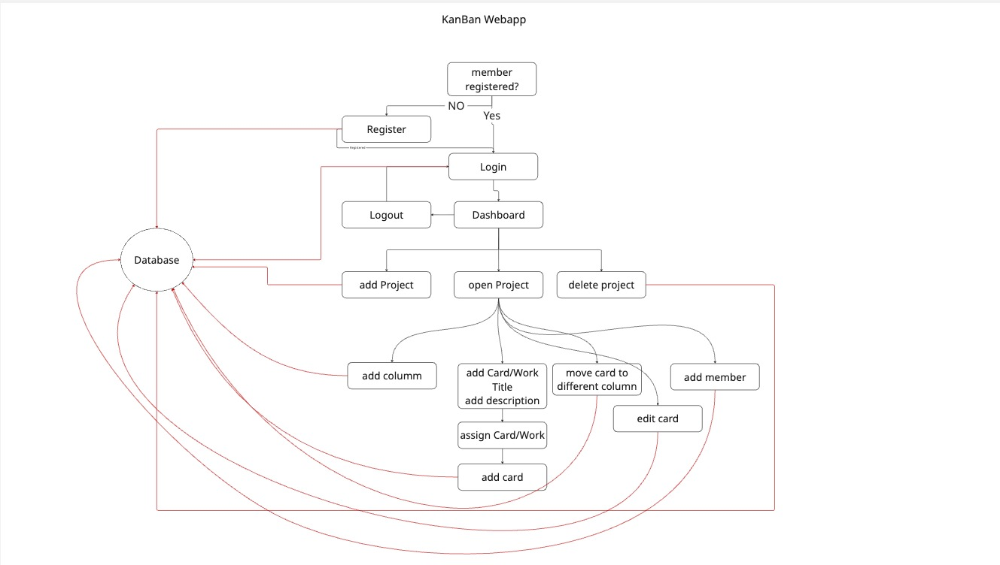

{: .label }
Caner Akgül

{: .no_toc }
# Architecture

{: .text-delta }

Table of contents

+ ToC
{: toc }

## Overview

Die **Kanban Web App** ist eine Flask-basierte Anwendung zur Verwaltung von Projekten und Aufgaben nach der Kanban-Methode.  
Registrierte Benutzer können Projekte erstellen, Aufgaben (Karten) verwalten, Spalten anpassen und Teammitglieder hinzufügen.  
Alle Daten werden in einer **lokalen SQLite-Datenbank** gespeichert.

Die Architektur folgt dem **Model-View-Controller (MVC)** Muster:

- **Model:** SQLite-Datenbank mit Tabellen für Benutzer, Projekte, Spalten, Karten und Mitglieder  
- **View:** Jinja2-Templates mit Bootstrap 5 für ein modernes, responsives Design  
- **Controller:** Flask-Routen für Authentifizierung, Projekt- und Aufgabenverwaltung  

Die App ist vollständig serverseitig umgesetzt und benötigt kein JavaScript.  
Sie eignet sich besonders für Lernzwecke, kleine Teams und Prototyping.

---

## Komponenten und Datenfluss

### 1. Authentifizierung (`app.py`)
- **Registrierung & Login:** Benutzer können sich registrieren und anmelden  
- **Session-Management:** Speicherung der Benutzersitzung mit Flask-Sessions  
- **Logout:** Löscht die Session-Daten und leitet zurück zur Login-Seite  

### 2. Dashboard
- **Projektübersicht:** Anzeige aller Projekte des angemeldeten Benutzers  
- **Projekt-Erstellung:** Neue Projekte mit Standardspalten (*To Do*, *In Progress*, *Review*, *Done*)  
- **Projekt-Löschung:** Entfernt ein Projekt inklusive aller zugehörigen Daten  

### 3. Projekt-Ansicht
- **Spaltenverwaltung:** Neue Spalten hinzufügen, umbenennen oder löschen  
- **Kartenverwaltung:** Aufgaben erstellen, bearbeiten, löschen oder in andere Spalten verschieben  
- **Mitglieder hinzufügen:** Weitere Benutzer einem Projekt zuordnen  

### 4. Datenbank (`db.py`)
- **SQLite-Datenbank:** Eine lokale Datei `kanban.db` speichert alle Informationen  
- **Tabellenstruktur:**  
  - `users`: Benutzerkonten  
  - `projects`: Projekte  
  - `columns`: Spalten innerhalb eines Projekts  
  - `cards`: Aufgaben (Karten)  
  - `project_members`: Zuordnung von Benutzern zu Projekten  
- **Foreign Keys:** Sorgen für Datenkonsistenz (z. B. Karten gehören zu Spalten, Spalten zu Projekten)

### 5. Frontend (`templates/` & `static/`)
- **Jinja2-Templates:** Dynamische HTML-Seiten mit Flask-Datenbindung  
- **Bootstrap 5:** Responsives, modernes Design  

---

## Datenfluss

1. **Benutzer-Aktion:** Benutzer registriert sich, loggt ein oder erstellt ein Projekt  
2. **Request-Verarbeitung:** Flask empfängt und verarbeitet die Anfrage  
3. **Controller-Logik:** `app.py` entscheidet, welche Daten abgefragt oder verändert werden  
4. **Datenbankzugriff:** `db.py` führt SQL-Befehle auf der SQLite-Datenbank aus  
5. **Template-Rendering:** Jinja2 erzeugt dynamisch HTML-Seiten mit aktuellen Daten  
6. **Antwort:** Die fertige HTML-Seite wird an den Browser gesendet  

---

## Codemap

### **Wichtige Dateien:**
- `app.py`: Zentrale Flask-App mit allen Routen (Login, Dashboard, Projekte)  
- `db.py`: Verwaltung und Initialisierung der SQLite-Datenbank  
- `templates/`: HTML-Templates mit Jinja2  
- `requirements.txt`: Abhängigkeiten (Flask, Bootstrap)  

---

## Cross-cutting Concerns

### **Session-Management**
- Über Flask-Sessions realisiert  
- Automatische Weiterleitung zum Login bei fehlender Authentifizierung  

### **Flash-Messages**
- Benutzerfeedback bei Aktionen (Erfolg, Fehler, Warnung)  
- Integration in das Basis-Template  

### **Responsive Design**
- Bootstrap 5 sorgt für ein flexibles, modernes Layout  
- Optimiert für Desktop, Tablet und Smartphone  

### **Datenkonsistenz**
- Foreign Keys und Transaktionen garantieren korrekte Beziehungen  
- Automatische Initialisierung über `flask --app app.py init-db`  

### **Sicherheit**
- Geschützte Routen über `@login_required`  
- Zugriff auf Projekte nur für Mitglieder  

---

Die Architektur ist **klar strukturiert**, **einfach erweiterbar** und bietet eine solide Grundlage für spätere Erweiterungen (z. B. Drag-and-Drop, API oder Rollenverwaltung).  
Weitere Details zur Implementierung befinden sich in den [Design Decisions](../design-decisions.md).
