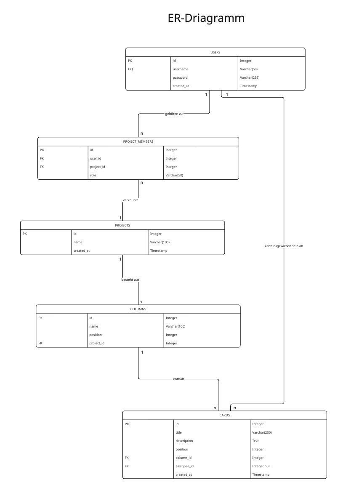

{: .label }
Caner Akgül

{: .no_toc }
# Data model

<details open markdown="block">
{: .text-delta }
<summary>Table of contents</summary>
+ ToC
{: toc }
</details>

# Übersicht

Für die **Kanban Web App** wurde ein vollständiges Datenmodell entwickelt, das alle Kernfunktionen abbildet – Benutzerverwaltung, Projekte, Spalten, Karten und Mitgliederzuordnung.  
Die Struktur basiert auf **SQLite** und ist für eine rein serverseitige Architektur mit **Flask** und **Jinja2** optimiert.  

Da wir uns bewusst gegen ORMs entschieden haben (siehe [Design Decisions](../design-decisions.md)), wurde ein leicht verständliches Schema mit klaren Beziehungen und Foreign Keys umgesetzt.

# ER-Diagramm



# Tabellen im Detail

**Users**

Die `users`-Tabelle speichert registrierte Benutzer, die sich anmelden, Projekte erstellen und Aufgaben übernehmen können.

- `id` (INTEGER PRIMARY KEY AUTOINCREMENT) – Eindeutige ID des Benutzers  
- `username` (TEXT UNIQUE NOT NULL) – Benutzername für den Login  
- `password` (TEXT NOT NULL) – Passwort für Authentifizierung  
- `created_at` (TIMESTAMP DEFAULT CURRENT_TIMESTAMP) – Zeitpunkt der Registrierung  

Ein User kann mehrere Projekte besitzen und Aufgaben zugewiesen bekommen.

---

**Projects**

Die `projects`-Tabelle repräsentiert einzelne Kanban-Projekte.

- `id` (INTEGER PRIMARY KEY AUTOINCREMENT) – Eindeutige Projekt-ID  
- `name` (TEXT NOT NULL) – Name des Projekts  
- `created_at` (TIMESTAMP DEFAULT CURRENT_TIMESTAMP) – Erstellungsdatum  

Ein Projekt enthält mehrere Spalten (Columns) und Karten (Cards) und kann mehrere Mitglieder haben.

---

**Project_Members**

Die `project_members`-Tabelle bildet eine **n:m-Beziehung** zwischen Benutzern und Projekten ab.

- `id` (INTEGER PRIMARY KEY AUTOINCREMENT)  
- `user_id` (INTEGER NOT NULL, FOREIGN KEY → users.id) – Benutzer im Projekt  
- `project_id` (INTEGER NOT NULL, FOREIGN KEY → projects.id) – Zugehöriges Projekt  
- `role` (TEXT DEFAULT 'member') – Rolle des Benutzers (z. B. *Owner* oder *Member*)  

Ein Benutzer kann in mehreren Projekten Mitglied sein, und ein Projekt kann mehrere Mitglieder haben.

---

**Columns**

Die `columns`-Tabelle definiert die Spaltenstruktur innerhalb eines Projekts – klassischerweise *To Do*, *In Progress*, *Review* und *Done*.

- `id` (INTEGER PRIMARY KEY AUTOINCREMENT) – Eindeutige Spalten-ID  
- `name` (TEXT NOT NULL) – Name der Spalte  
- `position` (INTEGER NOT NULL) – Reihenfolge der Spalte im Projekt  
- `project_id` (INTEGER NOT NULL, FOREIGN KEY → projects.id) – Zugehöriges Projekt  

Jedes Projekt erhält beim Erstellen automatisch die vier Standardspalten.

---

**Cards**

Die `cards`-Tabelle speichert Aufgaben oder Arbeitseinheiten, die sich in den Spalten befinden.

- `id` (INTEGER PRIMARY KEY AUTOINCREMENT) – Eindeutige Karten-ID  
- `title` (TEXT NOT NULL) – Titel der Aufgabe  
- `description` (TEXT) – Beschreibung der Aufgabe  
- `position` (INTEGER) – Reihenfolge in der Spalte  
- `column_id` (INTEGER NOT NULL, FOREIGN KEY → columns.id) – Zugehörige Spalte  
- `assignee_id` (INTEGER, FOREIGN KEY → users.id, NULLABLE) – Verantwortlicher Benutzer  
- `created_at` (TIMESTAMP DEFAULT CURRENT_TIMESTAMP) – Erstellungsdatum  

Eine Karte gehört zu genau einer Spalte, kann aber keinem oder einem Benutzer zugewiesen sein.

---

# Beziehungen

- **User verwaltet Projekte** (n:m) – Über `project_members`  
- **Projekt besteht aus Spalten** (1:n) – Über `columns`  
- **Spalte enthält Karten** (1:n) – Über `cards`  
- **User ist Kartenbearbeiter** (1:n) – Über `assignee_id`  

Damit ergibt sich eine klare hierarchische Struktur:  
**User → Project → Column → Card**

---

# Wichtige Queries

**Alle Projekte eines Benutzers:**
```sql
SELECT p.*
FROM projects p
JOIN project_members pm ON p.id = pm.project_id
WHERE pm.user_id = ?;
```

**Alle Spalten eines Projekts::**
```sql
SELECT * FROM columns
WHERE project_id = ?
ORDER BY position ASC;
```


**Alle Karten in einer Spalte:::**
```sql
SELECT * FROM cards
WHERE column_id = ?
ORDER BY position ASC;
```

**Alle Aufgaben, die einem Benutzer zugewiesen sind::::**
```sql
SELECT c.title, c.description, col.name AS column_name, p.name AS project_name
FROM cards c
JOIN columns col ON c.column_id = col.id
JOIN projects p ON col.project_id = p.id
WHERE c.assignee_id = ?;
```
**Mitglieder eines Projekts:::::**
```sql
SELECT u.username, pm.role
FROM project_members pm
JOIN users u ON pm.user_id = u.id
WHERE pm.project_id = ?;
```

# Design-Überlegungen

**Warum Standardspalten (To Do, In Progress, Review, Done)?**  
Der klassische Kanban-Workflow wird automatisch bereitgestellt, wodurch der Einstieg für Nutzer einfacher wird.

**Warum optionale assignee_id?**  
Nicht jede Aufgabe muss sofort jemandem zugewiesen sein – das unterstützt flexiblere Workflows.

**Warum eine eigene project_members-Tabelle?**  
So können mehrere Benutzer an einem Projekt zusammenarbeiten, ohne die Ownership-Logik in der projects-Tabelle zu verkomplizieren.

**Warum position in Columns und Cards?**  
Ermöglicht einfache Sortierung und spätere Erweiterung für Drag-and-Drop-Funktionalität.

