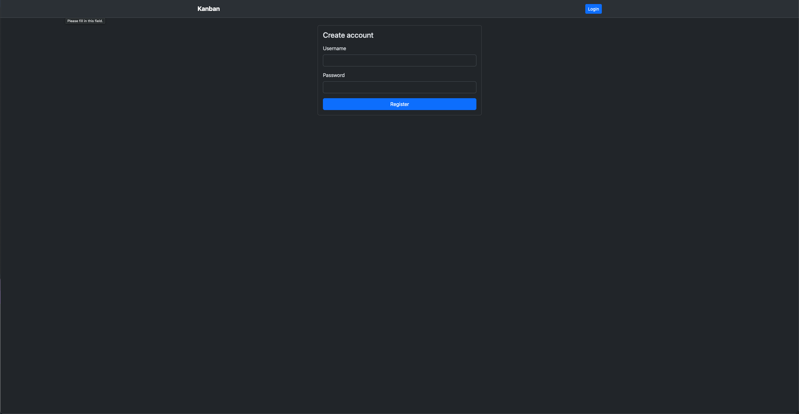
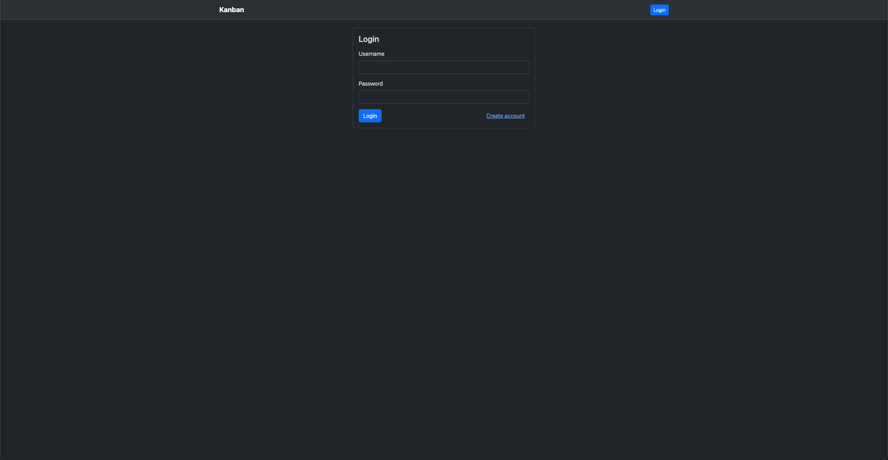
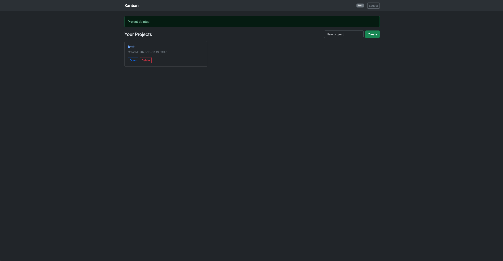
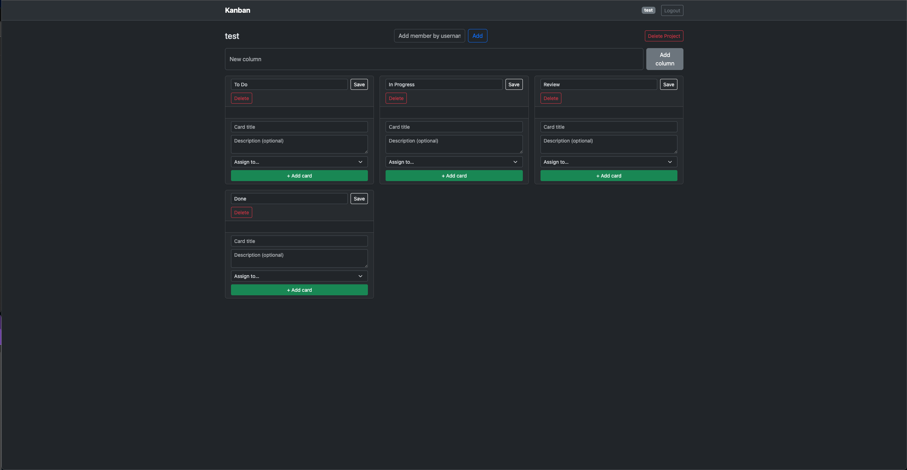
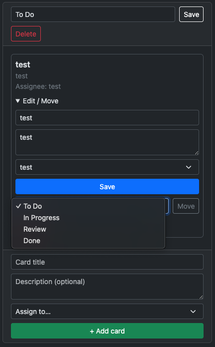

{: .label }
Caner Akgül

{: .no_toc }
# Reference documentation

{: .text-delta }

Table of contents

+ ToC
{: toc }

Diese Seite dokumentiert alle Routen, Funktionen und Hauptansichten der **Kanban Web App**.  
Die Anwendung ist mit Flask, Jinja2 und Bootstrap umgesetzt und gliedert sich in drei Hauptbereiche:  
**Authentifizierung**, **Projektverwaltung** und **Kanban-Board (Spalten, Karten, Mitglieder)**.

---

## app.py (Hauptanwendung)

### `home()`

**Route:** `/`  
**Methods:** `GET`  
**Purpose:**  
Leitet Benutzer automatisch weiter — eingeloggte Benutzer sehen das Dashboard, nicht eingeloggte Benutzer die Login-Seite.

---

### `register()`

**Route:** `/register`  
**Methods:** `GET`, `POST`  
**Purpose:**  
Erstellt neue Benutzerkonten.  
Bei `GET` wird das Formular angezeigt, bei `POST` werden Daten geprüft und in der Datenbank gespeichert.

**Sample output:**

---

### `login()`

**Route:** `/login`  
**Methods:** `GET`, `POST`  
**Purpose:**  
Authentifiziert Benutzer über Benutzername und Passwort.  
Bei erfolgreichem Login wird eine Session gesetzt.

**Sample output:**

---

### `logout()`

**Route:** `/logout`  
**Methods:** `GET`  
**Purpose:**  
Löscht die aktuelle Session und leitet den Benutzer zurück zur Login-Seite.

---

### `dashboard()`

**Route:** `/dashboard`  
**Methods:** `GET`  
**Purpose:**  
Zeigt alle Projekte des eingeloggten Benutzers.  
Ermöglicht das Erstellen, Öffnen und Löschen von Projekten.

**Sample output:**

---

### `project_create()`

**Route:** `/project/create`  
**Methods:** `POST`  
**Purpose:**  
Erstellt ein neues Projekt.  
Beim Anlegen werden automatisch Standardspalten (*To Do*, *In Progress*, *Review*, *Done*) erzeugt.

**Sample output:**

---

### `project_view(project_id)`

**Route:** `/project/<int:project_id>`  
**Methods:** `GET`  
**Purpose:**  
Zeigt die Detailansicht eines Projekts als **Kanban-Board** mit allen Spalten, Karten und Mitgliedern.  
Hier können Benutzer neue Karten hinzufügen, bearbeiten, verschieben oder löschen.

**Sample output:**

---

### `project_delete(project_id)`

**Route:** `/project/<int:project_id>/delete`  
**Methods:** `POST`  
**Purpose:**  
Löscht das Projekt samt aller zugehörigen Spalten und Karten.

---

### `add_member_route(project_id)`

**Route:** `/project/<int:project_id>/members/add`  
**Methods:** `POST`  
**Purpose:**  
Fügt einem Projekt einen weiteren Benutzer hinzu.  
Erfordert den Benutzernamen des hinzuzufügenden Mitglieds.

---

## Column Management

### `column_create_route()`

**Route:** `/column/create`  
**Methods:** `POST`  
**Purpose:**  
Erstellt eine neue Spalte in einem Projekt.  
Standardspalten sind bereits vorhanden, zusätzliche können hinzugefügt werden.

---

### `column_rename_route(column_id)`

**Route:** `/column/<int:column_id>/rename`  
**Methods:** `POST`  
**Purpose:**  
Erlaubt das Umbenennen einer Spalte im Kanban-Board.

---

### `column_delete_route(column_id)`

**Route:** `/column/<int:column_id>/delete`  
**Methods:** `POST`  
**Purpose:**  
Löscht eine Spalte und alle darin enthaltenen Karten.

**Sample output:**

---

## Card Management

### `card_create_route()`

**Route:** `/card/create`  
**Methods:** `POST`  
**Purpose:**  
Fügt einer Spalte eine neue Karte hinzu.  
Karten enthalten Titel, optionale Beschreibung und optionale Zuweisung an ein Teammitglied.

**Sample output:**

---

### `card_edit_route(card_id)`

**Route:** `/card/<int:card_id>/edit`  
**Methods:** `POST`  
**Purpose:**  
Bearbeitet Titel, Beschreibung und Verantwortlichen einer Karte.

---

### `card_move_route(card_id)`

**Route:** `/card/<int:card_id>/move`  
**Methods:** `POST`  
**Purpose:**  
Verschiebt eine Karte in eine andere Spalte (z. B. von *To Do* nach *In Progress*).  
Diese Aktion simuliert Drag & Drop, da JavaScript nicht verwendet wird.

**Sample output:**

---

### `card_delete_route(card_id)`

**Route:** `/card/<int:card_id>/delete`  
**Methods:** `POST`  
**Purpose:**  
Löscht eine Karte aus einer Spalte.

---

## Templates

Alle Seiten verwenden **Jinja2**-Templates mit **Bootstrap 5 (Dark Mode)** für modernes, responsives Design.

| Template | Beschreibung |
|-----------|---------------|
| `base.html` | Grundlayout mit Navigation, Flash Messages und Styles |
| `login.html` | Login-Seite |
| `register.html` | Registrierung |
| `dashboard.html` | Projektübersicht |
| `project.html` | Haupt-Kanban-Ansicht |
| `404.html` | Fehlerseite (optional) |

---

## Datenbank (db.py)

Die App verwendet eine einfache **SQLite**-Datenbank (`kanban.db`) mit folgenden Tabellen:

- `users` – Speichert Benutzername und Passwort  
- `projects` – Enthält alle Projekte  
- `project_members` – Zuordnung von Benutzern zu Projekten  
- `columns` – Spalten innerhalb eines Projekts  
- `cards` – Karten, Aufgaben oder Tasks innerhalb einer Spalte  

Funktionen in `db.py`:

| Funktion | Zweck |
|-----------|-------|
| `init_db_all()` | Erstellt alle Tabellen, wenn sie nicht existieren |
| `create_user(username, password)` | Legt neuen Benutzer an |
| `check_login(username, password)` | Prüft Login-Daten |
| `create_project(name, user_id)` | Erstellt Projekt mit Standardspalten |
| `list_user_projects(user_id)` | Gibt alle Projekte eines Benutzers zurück |
| `get_project(project_id)` | Gibt Projektdetails zurück |
| `create_column(project_id, name)` | Fügt Spalte hinzu |
| `create_card(column_id, title, desc, assignee)` | Fügt Karte hinzu |
| `update_card(card_id, title, desc, assignee)` | Aktualisiert Karte |
| `move_card(card_id, to_col)` | Verschiebt Karte in andere Spalte |
| `delete_card(card_id)` | Löscht Karte |

---

## Flash Messages

Für Benutzer-Feedback nutzt die App **Flask Flash Messages**:

- ✅ *Erfolg:* „Projekt erstellt“, „Karte hinzugefügt“  
- ⚠️ *Warnung:* „Benutzer nicht gefunden“  
- ❌ *Fehler:* „Keine Berechtigung“, „Ungültige Eingabe“

Diese werden in `base.html` automatisch über Bootstrap-Styling angezeigt.

---

## Beispiel Workflow

1. Benutzer registriert sich und loggt ein.  
2. Im Dashboard erstellt er ein Projekt.  
3. Automatisch werden Spalten „To Do“, „In Progress“, „Review“ und „Done“ angelegt.  
4. Der Benutzer erstellt Karten, fügt Beschreibungen hinzu und weist sie Teammitgliedern zu.  
5. Karten werden Schritt für Schritt durch die Spalten bewegt.  
6. Nach Abschluss kann das Projekt gelöscht werden.

---

## Beispiel Screens

**Login-Seite**

**Register-Seite**

**Dashboard**

**Projektansicht**

**Kartenbearbeitung**

